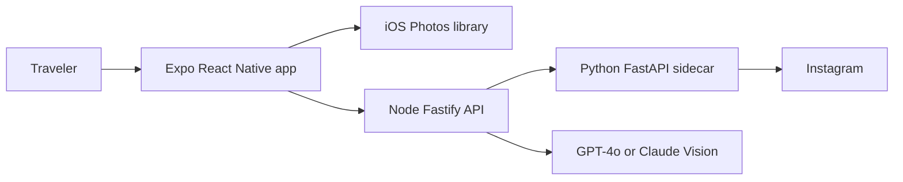
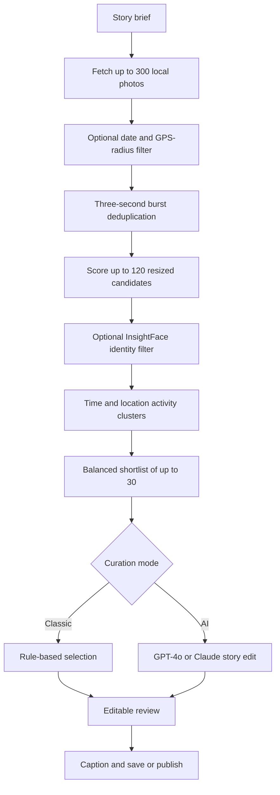

# Pixory — High-Level Design

This document describes the **current implementation**. Archived prototypes and unused code are identified explicitly.

## 1. Product scope

Pixory is an iOS-first app for travelers who return from a trip with too many photos. It narrows a date- and location-bounded camera-roll set, removes repeats, scores and balances candidates, optionally turns them into an AI-edited narrative carousel, and lets the user revise, save, or publish the result.

## 2. System context

| Active component | Responsibility |
| --- | --- |
| `photosort-app/` | Story setup, photo retrieval, local filtering/deduplication, shortlist construction, review, learning, persistence, and save/publish UI |
| `backend/src/` | Fastify API, image resizing, AI curation and role assignment, and sidecar proxy routes |
| `backend/publish_sidecar.py` | Computer-vision scoring, face registration/matching, Instagram sessions, location search, and publishing |
| `backend/face_engines/` | Default InsightFace engine and optional DeepFace comparison engine |

### Excluded from the active architecture

- `instagram_sorter/` is an archived prototype. The current app and backend neither import nor launch it.
- `photosort-app/modules/vision-scorer/ios/VisionScorerModule.swift` contains an old Apple Vision `scorePhoto` implementation, but the current pipeline never calls it. The module's only reachable use is batched `PHAsset.location` lookup, which uses the Photos framework—not Apple Vision.

## 3. Runtime flow

### 3.1 Retrieval and location filtering

The user supplies a date range and may add a place/radius, story prompt, persona, AI/classic mode, and “only photos with me.” The app uses `expo-media-library` to fetch up to 300 photos, reads local metadata and iOS favorites, and skips iCloud-only assets without a local URI.

For optional GPS filtering it geocodes the place, attempts native batched `PHAsset.location` lookup, falls back to `MediaLibrary.getAssetInfoAsync()`, and applies a Haversine-radius filter. Missing GPS fails open with a user-facing explanation.

### 3.2 Deduplication

The active flow groups photos taken within three seconds and keeps the highest initial-quality member. The scoring sidecar also computes pHash, and `lib/photos/dedup.ts` contains a second-pass helper using Hamming distance at most 10. That helper is **not currently invoked** by `processing/hooks.ts`, so broader perceptual deduplication is implemented but not active.

### 3.3 Computer-vision scoring

`photosort-app/lib/photos/scoring.ts` sends 512-pixel JPEGs in batches of ten to `POST /api/score_photos`, with a default ceiling of 120. Fastify proxies them to `backend/publish_sidecar.py`, which computes:

- Laplacian-variance sharpness;
- face and happy-face counts;
- brightness and brightness quality;
- contrast and saturation;
- Canny edge-density complexity;
- shot type (`closeup`, `medium`, `wide`);
- largest-subject ratio;
- group size (`none`, `solo`, `duo`, `group`); and
- perceptual hash.

Per-photo failures return neutral scores. If the sidecar is unavailable, the app falls back to its file-size/resolution proxy.

### 3.4 Face identity

The application default is InsightFace; engines are lazy-loaded and cached.

**InsightFace (default)**

- `buffalo_l`, SCRFD detection, ArcFace 512-dimensional normalized embeddings
- ONNX Runtime CPU provider
- HSEmotion-ONNX `enet_b0_8_best_afew` for happiness/surprise
- cosine match threshold 0.35
- largest reference face; best match among every candidate face

**DeepFace (comparison option)**

- MTCNN detection/emotion and FaceNet 128-dimensional embeddings
- strict MTCNN → permissive MTCNN → OpenCV registration fallback
- cosine match threshold 0.45

Embeddings are stored locally by engine because the vector spaces are incompatible. In “only photos with me” mode, face-containing photos are matched; non-face photos remain eligible. Matching errors fail open.

### 3.5 Persona scoring and learning

The client maps sidecar signals to different editorial definitions:

| Persona | Emphasis |
| --- | --- |
| Aesthete | Sharpness, palette/color, low clutter |
| Social Connector | Happy faces, people, close framing |
| Experience Logger | Lived-in complexity and documentary value |
| Storyteller | Balanced light and varied moment coverage |
| Mood Poster | Saturation, light quality, atmospheric wide shots |

Adding a runner-up records a promoted example; removing an initial selection records a rejected example. After five combined examples, cosine similarity to promoted versus rejected feature averages applies a bounded 0.75–1.25 score multiplier. Learning and the derived taste profile remain local.

### 3.6 Clustering and shortlist

A new activity cluster begins when consecutive photos are more than 30 minutes or 1.5 km apart. Candidate selection covers four time windows, represents distinct clusters, and fills remaining slots using persona-specific close-up/medium/wide targets. Storyteller gets a diversity bonus for a cluster's sole representative. AI mode produces up to 30 candidates and 20 runner-ups; classic mode selects ten without cloud narrative AI.

### 3.7 AI curation

The client sends the shortlist to `POST /api/curate_device_photos`. Fastify resizes inputs and invokes GPT-4o or Claude. Prompts may include the story prompt, persona, favorites, shot/group metadata, optional user reference, and named face profiles.

The model returns selected indices, `hook/world/life/detail/closer` roles and reasons, ordering, a story summary, a missing beat, and four caption variants. After manual edits, `POST /api/assign_roles` can recalculate roles and ordering without excluding submitted photos.

### 3.8 Review, persistence, and publishing

The user can add runner-ups, remove selections, and reorder the carousel. Drafts, story history, preferences, identity, and learning history are stored locally. Instagram publishing flows through Fastify to the **active** Python sidecar, which uses Instagrapi and stores sessions under `~/.pixory/sessions`.

## 4. Active API surface

| Route | Responsibility |
| --- | --- |
| `GET /health` | Backend health |
| `POST /api/score_photos` | Batch sidecar scoring |
| `POST /api/register_face` | Engine-specific reference embedding |
| `POST /api/match_faces` | Candidate identity matching |
| `POST /api/curate_device_photos` | AI selection, story, ordering, captions |
| `POST /api/assign_roles` | Roles/order after user edits |
| `POST /api/search_location` | Instagram location search |
| `POST /api/account_info` | Connected account details |
| `POST /api/publish_from_device` | Sidecar carousel publishing |
| `DELETE /api/session/:username` | Delete persisted Instagram session |

## 5. Data boundaries

| Data | Current location |
| --- | --- |
| Library query, story state, identity embeddings, learning history | Mobile device |
| Up to 120 resized scoring candidates | Configured backend and Python sidecar |
| Up to 30 resized narrative candidates | Backend and selected AI provider |
| Optional AI face reference | Sent only with active AI face filtering |
| Instagram credentials during publish | Backend/sidecar request path |
| Instagram session | Python sidecar filesystem |

The backend URL may be remote. Therefore “only 30 photos leave the device” is not accurate today: cloud AI sees at most the shortlist, but the scoring sidecar can receive up to 120 resized candidates.

## 6. Failure behavior

- Missing Photos permission stops with Settings guidance.
- Missing GPS or geocoding failure retains the date-bounded set.
- Unavailable assets are skipped.
- Sidecar failure uses file-quality fallback.
- Face-matching failure skips the constraint rather than failing curation.
- Individual scoring failure returns neutral metrics.
- AI and publishing errors are surfaced for recovery.

## 7. Production gaps

- Add backend authentication, TLS, restricted CORS, request limits, and rate limiting.
- Define image retention, deletion, and telemetry-redaction policy.
- Protect or replace filesystem-backed Instagram sessions.
- Benchmark face-matching errors across lighting, occlusion, skin tones, age, and group size.
- Validate model and publishing-library licenses/platform compliance.
- Remove or isolate the unused native Apple Vision scorer.
- Replace the hard-coded development backend URL with environment configuration.
- Add mobile-to-sidecar end-to-end tests.
- Wire and validate the existing pHash deduplication pass before describing near-duplicate removal as active behavior.

## 8. Sources of truth

- Pipeline orchestration: `photosort-app/app/screens/processing/hooks.ts`
- Retrieval, scoring, deduplication, clustering, selection: `photosort-app/lib/photos/`
- Personalization and identity: `photosort-app/lib/learning/`, `photosort-app/lib/identity/`
- API and AI curation: `backend/src/routes/`, `backend/src/services/`
- Active scoring, identity, and publishing sidecar: `backend/publish_sidecar.py`, `backend/face_engines/`

Do not use `instagram_sorter/` or the unused native `scorePhoto` export to infer current product behavior.
